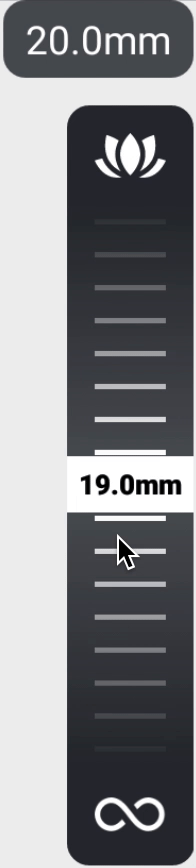

# SLIDER LAYOUT

This is a simple Android `Layout` which utilizes a `LinearSnapHelper()`, `android:clipToPadding="false"` and
padding equal to half of the `RecyclerView`'s height (or width for horizontal) to achieve a the behaviour
of a slider which selects the item in the middle of it.

# SAMPLE

